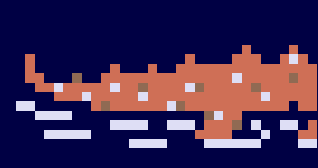
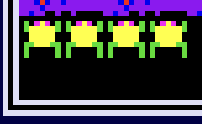

# Functional Specifications

## Table of content

- [Document control](#document-control)
    - [Document information](#document-information)
    - [Document validation](#document-validation)
- [A. Introduction](#a-introduction)
    - [1. Overview](#1-overview)
    - [2. Project definition](#2-project-definition)
        - [Vision](#vision)
        - [Objectives](#objectives)
        - [Scope](#scope)
        - [Deliverables](#deliverables)
    - [3. Project organization](#3-project-organization)
        - [Stakeholders](#stakeholders)
        - [Project team](#project-team)
- [B. Functional requirements](#b-functional-requirements)
    - [1. Frogger overview](#1-frogger-overview)
        - [History](#history)
        - [Gameplay](#gameplay)
    - [2. Frogger breakdown](#2-frogger-breakdown)
        - <a href="#FroggerInterface">Interface</a>
            - [Grid](#grid)
            - [Fonts](#fonts)
            - [Score](#score)
            - [Timer](#timer)
        - [Environment](#environment)
            - [Finish line](#finish-line)
            - [Insects](#insects)
            - [Lady frogs](#lady-frogs)
            - [Road](#road)
            - [Cars](#Cars)
            - [River](#river)
            - [Wood logs](#wood-logs)
            - [Turtles](#turtles)
            - [Crocodiles](#crocodiles)
            - [Snakes](#snakes)
            - [Otters](#otters)
            - ["Safe zones"](#safe-zones)
        - [Player](#player)
            - [Movements](#movements)
            - [Lives and death](#lives-and-death)
            - [Scoring](#scoring)
            - [2nd player](#2nd-player)
        - [Sounds](#sounds)
    - [3. Our version](#3-our-version)
        - <a href="#OurInterface">Interface</a>
        - [The Game](#the-game)
            - [The environment](#the-environment)
            - [The player](#the-player)
    - [4. Personas definition](#personas-definition)
- [C. Non functional requirements](#c-non-functional-requirements)
    - [1. Operability](#1-operability)
    - [2. Delivery](#2-delivery)
    - [3. Maintainability](#3-maintainability)
- [D. Glossary](#d-glossary)
  

# Document control

## Document information

| Document name | Document owner | Date of last update |
| --- | --- | --- |
| Functional specifications | Evan UHRING | 9/27/2024 |

## Document validation

| Role | Name | Signature | Date |
| --- | --- | --- | --- |
| Project Manager | Enzo GUILLOUCHE |  |  |
| Tech Lead | Maxime CARBON |  |  |
| Software Developer | Elone DELILLE |  |  |
| Quality Assurance | Axel DAVID |  |  |
| Technical Writer | Pierre GORIN |  |  |

  

# A. Introduction

## 1. Overview

We were tasked top recreate the game Frogger using an FPGA<a href="#1">[1]</a> using the verilog<a href="#2">[2]</a> language.

## 2. Project definition

### Vision
---

Make a recreation of the game Frogger while adding our own touch to it.

### Objectives 
---

- Recreate the game Frogger
- Has to be made using an FPGA
- The programming language has to be verilog

### Scope 
---

| In scope |
| --- |
| Deliver a playable Frogger with increasing levels |
| Must run on an FPGA |
| Be programed using verilog |
| Be made using a 20x15 grid |
| Each cell of the grid has to be 32x32 pixels |
| Each button of the FPGA has to be one of the four direction movement |
| The game can be reset to the beginning by pressing the four buttons of the FPGA at the same time |
| The display has to be a VGA display |
| The level number has to be displayed using the two seven segment displays of the FPGA |

| Out of scope |
| --- |
| Each level don't increase in difficulty |
| Having a menu |
|

### Deliverables
---

| Name | Type | Deadline | Link |
|---|---|---|---|
| Functional specifications document | Document (markdown) | 10/07/2024 | [functionalSpecifications.md](functional_specifications.md) |
| Technical specifications document | Document (markdown) | 10/14/2024 | [technicalSpecifications.md](../technical/technical_specifications.md)|
| Weekly reports | Document (markdown) | Every Friday | [weeklyReports/](../management/weekly_reports)|
| Test plan | Document (markdown) | 10/21/2024 | [testPlan.md](../quality/) |
| User manual | Document (pdf) | 10/21/2024 | [userManual.md](../quality/) |

## 3. Project organization

### Stakeholders
---

| Name | Occupation | Links |
| --- | --- | --- |
| ALGOSUP | Client | [Website](https://algosup.com) |

### Project team
---

| Role | Description | Name |
|---|---|---|
| Project manager | Is in charge of organization, planing and budgeting. Keep the team motivated. | Enzo GUILLOUCHE |
| Program manager | Makes sure the project meets expectation. Is in charge of design. Is responsible for writing the Functional Specifications | Evan UHRING |
| Technical leader | Makes the technical decision in the project. Translates the Functional Specification into Technical Specifications.  Does code review. | Maxime CARON |
| Software engineer | Writes the code. Writes documentation Participate in the technical design. | Elone DELILLE |
| Quality assurance |  Tests all the functionalities of a product to find bugs and issues. Document bugs and issues. Write the test plan. Check that issues have been fixed.| Axel DAVID |
| Technical writer | Is in charge of writing a user manual | Pierre GORIN |
  

# B. Functional requirement

## 1. Frogger overview

### History
---

Frogger is an arcade action game developed by Konami<a href="#3">[3]</a> in the year 1981, then published by SEGA<a href="#4">[4]</a> outside of Japan.

### Gameplay
---

In Frogger, the player plays a frog and try to cross the road and the river all the way to the top of the screen in a limited period of time to gain points. Reaching the finish line with a "lady frog" and/or stepping on an insect gives more points. The player as limited lives, if he looses each one the them, the game is over. The levels keeps increasing the difficulty if the player finishes them.

## 2. Frogger breakdown

<h3 id="FroggerInterface">Interface</h3>

---

#### Grid

Frogger uses a grid 14x16. Each cell is 16x16 pixels, which makes a total of 224x256 pixels.

#### Fonts

It uses the monospace sans-serif font in uppercase, the same font as the game Pac-Man. It also uses it in multiple colors such as white, red, yellow, blue and pink. There is also a sprite of five letters used for the title of the game with a special color style.

 

#### Score

The score display is made into two parts: the first one being the current score entitled "1-UP", and the second one being the highest score entitled "HI-SCORE". The scores are shown using five numbers each. The high score is placed at the top of the screen right in the middle while the current score is placed at the left of the high score.

#### Timer

A special mechanic to the game is the timer. Each time you try to get to the finish line, the player has a limited period of time. It is shown at the bottom of the screen, using a text to tell that it is the timer with the yellow font, and a green bar that decreases in length to tell how many time is left before loosing.

The timer lasts for 30 seconds, translated into 60 "beats" or "ticks" (the term beats will be used for the rest of the document). Every time the player gets to the finish line before the end of the timer, a message in the middle of the screen tells how many beats was left, which then gives certain number of points (described in [Scoring](#scoring)).

<i style="font-size: 12px">Example of the time left message, here the player got to the finish line 26 beats before the end of the timer</i> 

### Environment
---

The game is created in two times: first there is the background, then we add the different sprites that moves on the screen.

<i style="font-size: 12px">First image is only the background, the second is with the moving sprites</i> 

#### Finish line

The finish line is described by the green area at the top:

 

To win the level, the player has to go on each of the five water cells, and not on the grass.

<i style="font-size: 12px">Every animation steps when stepping on a finishing cell</i> 

#### Insects

Sometimes, an insect can spawn on one water cell of the finish line.

 

When going on it, you gain extra points (see [points table](#scoring))

#### Lady frogs

As well as the insect, a lady frog can spawn 

#### Road

The road is a part of the environment where cars pass by. 

 

It takes five rows of the grid.

#### Cars

There are five types of car, each one using its own row of the road.

Each type of car has a pattern, which is not random.

#### River

Slightly like the road, the river is also a part of the environment, but this time wood logs, turtles, crocodiles, otters and snakes go through it.

 

Same as the road, the river takes five rows of the grid.

#### Wood logs

The wood logs appear in the river, and go from the left to the right. They come with different width.

 
 
 

The player can step on them to cross the river, but because the wood logs move along the river, so the player can't stay on them.

#### Turtles

The turtles work like the wood logs with one exceptions: they can go under water, and so the player can't step on them.

#### Crocodiles

The crocodiles also work like the wood logs with as well one difference: if the player tries to step on the face of a crocodile, the player dies.

The crocodiles sprites are separated into two sprites: the body and the head. The body never changes but the face can have an open or a closed mouth to animate it.

 

 

Crocodiles start to appear at the second level, and replaces some wood logs.

#### Otters

#### Snakes

#### "Safe zones"

The "safe zones" are the area where the player can stay without getting killed by anything. They are the purple grass zones below the road and between the road and the river.

 

But after finishing the first two levels, snakes appear and the "safe zones" are no longer safe, can snake can sometimes go through them, and kill the player.

### Player
---

The player incarnates a yellow and green frog, which goal is to get across the road and the river alive.

 

#### Movements

The player will be able to move in four directions: up, down, left and right. It has six different sprites, 2 for the static position looking to the left and to the top, 4 for the movements with two looking to the left and two looking to the top.

 

The sprites are then rotated correctly to the direction the player is going, the sprites looking to the left are also used for when the player goes to the right, and the sprites looking to the top are also used when the player goes down.

The movement animation is composed of ten steps. The first 3 steps uses the static sprite, then for the next four steps, the sprite changes to the first jumping sprite, then changes for two steps with the last movement sprite, finally getting to the end position, it changes back to the static sprite. On each step, the sprite goes to the direction where the player is going to two pixels, getting to 16 pixels at the ninth step.

<i style="font-size: 12px">Each of the ten steps when doing a movement</i> 
 

#### Lives and death

The player starts with three lives. He can gain one life after getting enough points. The lives are displayed at the bottom left of the screen.

 

The player can die by either getting run over by a car, falling into the river, getting bitten by the crocodiles and snakes. When the frog dies, the number of lives decreases by one. There are two different death animations: one when the player falls into the river, and one for every other deaths.

<i style="font-size: 12px">Drowning sprites for falling into the river</i> 

<i style="font-size: 12px">Squash sprites for every other deaths</i> 

#### Scoring

The player has multiple way to get points:

| Actions that give points | How many |
| --- | --- |
| Getting closer to the finish line | Each row crossed gives 10 points once per frog |
| Getting to the finish line | 50 points every time |
| Beating the timer | 10 points per beats saved |
| Escorting a lady frog | 200 points |
| Eating an insect | 200 points |
| Saving five frogs (getting to the finish line five times) | 1000 points per level |

#### 2nd player

In Frogger, a second player can play the game, but the two players play separately: when one finishes his level, the other player can now play his level, until he finishes to let the first player play again the next level.

### Sounds
---

## 3. Our version

<h3 id="OurInterface">Interface</h3>

---

For our Frogger, our requirements are to create it using VGA, which gives us a resolution of 640x480 pixels. This resolution while be divided into a grid of 20x15 cells, with each cell having a resolution of 32x32 pixels.

Following our requirement, we will not have a timer nor a score, but the level number will be displayed using the two seven segments displays of the FPGA.

The font that we will use will be the same as the original game, but we will only use the blue, white and red fonts.

When starting the game, the player will get to a menu, where he can choose to play or to quit. While in game, you can open a pause menu, to either go back to the main menu, restart or continue.

### The game

#### The environment

The environment, following our requirements, will be separated into two different types of zones: the safe zones and the roads. They are distributed on every 15 rows that are available (described <a href="#distri-table">here</a>). On the roads, cars will go from left to right or right to left, depending on how it will be set for each row (described <a href="#distri-table">here</a>). 

We will use 3 different sprites for the cars, each of them fitting in one cell of the grid. Tow of the cars that we will use are up-scales from the original sprites, and one has been created by us. Each car will have its own row (described <a href="#distri-table">here</a>). They will also have different speeds, defined by lowest, medium and highest. The car 1 as a medium speed, the car 2 has the lowest speed and the car 3 has the highest.

<i style="font-size: 12px">Car 1, 2 and 3 in this exact order</i> 

  

Distribution of the zones:

| | | |
| --- | :---: | --- |
|  | Safe zone (Finish line)|
|  | Road (left to right) Car 2|
|  | Road (left to right) Car 1|
|  | Road (right to left) Car 3|
|  | Road (right to left) Car 1|
|  | Road (left to right) Car 2|
|  | Road (right to left) Car 3|
|  | Safe zone |
|  | Safe zone |
|  | Road (right to left) Car 3|
|  | Road (left to right) Car 1|
|  | Road (right to left) Car 2|
|  | Road (left to right) Car 3|
|  | Road (left to right) Car 2|
|  | Safe zone (start line) |
| |

We will use sprites to show the different zones, one is a road and the other one is grass:

<i style="font-size: 12px">Road on the right, grass on the left</i> 

When getting to the top safe zone, the player will have to go forward once more to get to the next level. He will be then teleported back at the bottom to begin the next level, with a higher difficulty represented by the increased speed of the cars as well as the number of car shown at once increased.

#### The player

The player will incarnate a frog that will try to get across the roads without getting run over a car.

The frog will be a redesign of the original from, to fit the up-scale of the game compared to the original game. It will have two other sprites for the animation of movement, and we will use sprites that only look into one direction, so we will have to flip them to the direction where the player is going. The movement animation is separated into three sprites, the first sprite being the one when the player doesn't move:

The player will be able to move in four directions: up, down, left and right.

When the player gets ran over by a car, he will get a game over menu where he can either restart or quit the game.

## 4. Personas definition

| **:** | **:** | **:** |
| --- | --- | --- |
|  |  |  |
| Name:  | Name:  | Name:  |
| Age:  | Age:  | Age:  |
| Problem:  | Problem:  | Problem:  |
| What he wants:  | What he wants:  | What she wants:  |
  

# C. Non functional requirements

## 1. Operability

- Runs on an FPGA

## 2. Delivery

- The game program will be available on our [GitHub](https://github.com/algosup/2024-2025-project-1-fpga-team-6).

## 3. Maintainability

- Commented and documented code
  

# D. Glossary

| Word | Definition | Source |
| --- | --- | --- |
| <a id="1">[1]</a>: FPGA |  | [wikipedia.org](https://en.wikipedia.org/wiki/Field-programmable_gate_array) |
| <a id="2">[2]</a>: verilog |  |  |
| <a id="3">[3]</a>: Konami |  |  |
| <a id="4">[4]</a>: SEGA |  |  |
| <a id="5">[4]</a>: sprite |  |  |