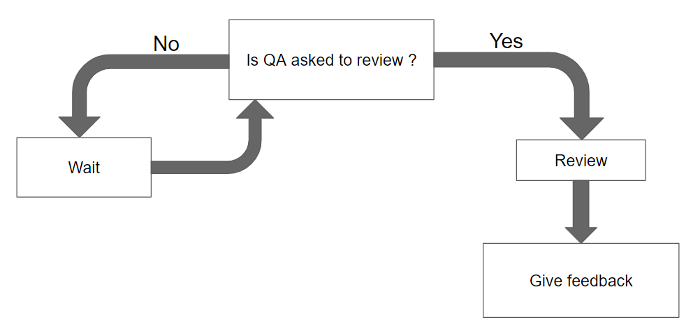
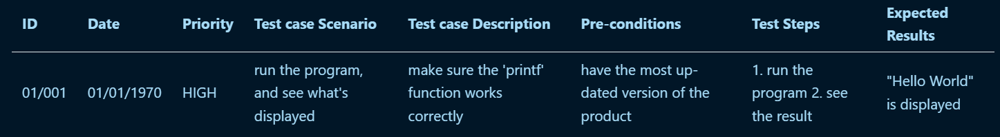
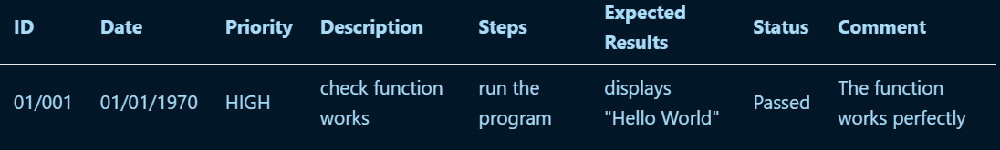

# Test-Plan
|Authors|Axel David|
|---|---|
|Created|23/09/2024|
|Last Modified|21/10/2024|
## Test-Plan-Approval
| Role | Name | Signature | Date |
|---|---|---|---|
| Project Manager | Enzo GUILLOUCHE	|----------|--/10/2024|
| Program Manager | Evan UHRING	|----------|--/10/2024|
| Technical Lead | Maxime Caron |----------|--/10/2024|
| Software Developer | Elone Delille |----------|--/10/2024|
| Technical Writer | Pierre GORIN	|----------|--/10/2024|
| Quality Assurance | Axel David |----------|--/10/2024|
## Table-of-Contents

Table of Contents

- [Test Plan](#test-plan)
  - [Test Plan Approval](#test-plan-approval)
  - [Table of Contents](#table-of-contents)
  - [1. Introduction](#1-introduction)
    - [a. Overview](#a-overview)
    - [b. Targetted Audience](#b-targetted-audience)
      - [Retro Gaming Player](#retro-gaming-player)
      - [New Player](#new-player)
      - [Speed Runner](#speed-runner)
    - [c. Softwares/Hardwares](#c-softwares-hardwares)
      - [FPGAs](#fpgas)
      - [VERILOG](#verilog)
  - [2. Test criteria](#2-test-criteria)
    - [a. Suspension Criteria](#a-suspension-criteria)
      - [Critical Bugs](#critical-bugs)
    - [b. Entry Criteria](#b-entry-criteria)
    - [c. Exit Criteria](#c-exit-criteria)
  - [3. Test Strategy](#3-test-strategy)
    - [a. Testing Scope](#a-testing-scope)
    - [b. Testing Type](#b-testing-type)
      - [Unit Tests](#unit-tests)
      - [Functional Tests](#functional-tests)
      - [Collaborative Game-Testing](#collaborative-game-testing)
    - [c. Define Priorities](#c-define-priorities)
    - [d. Test Tool](#d-test-tool)
      - [System VERILOG](#system-verilog)
      - [EDA Playground](#eda-playground)
    - [e. Test Cases](#e-test-cases)
    - [f. Test Reports](#f-test-reports)
    - [g. Test Progression](#g-test-progression)
  - [4. Schedule Estimation](#4-schedule-estimation)
  - [5. Test Deliverables](#5-test-deliverables)
  - [6. Glossary](#6-glossary)

## 1-Introduction
### a-Overview
We were tasked to recreate the game Frogger using an FPGA<a href="#1">[1]</a> using the verilog<a href="#2">[2]</a> language.

### b-Targetted-Audience
According to the types of players, our Frogger will have differents requierements. 
<i>Take a look at personas definition in [functional specification](https://github.com/algosup/2024-2025-project-1-fpga-team-6/blob/main/Documents/FunctionalSpecifications/functionalSpecifications.md#4-personas-definition) for more informations</i>

#### Retro-Gaming-Player
What retro players need is a game that works just fine and that allows them to feels the sentation of old games.

#### New-Player
What new players need is a working game that let them experience the game without the risk of any issues coming from the game.

#### Speed-Runner
What speed runners need is a game with no bugs and fast enough to allow them to play fast without the game crashing.

### c-Softwares-Hardwares
For this frogger project, we have been imposed to use specifics hardware and software.

#### FPGAs
FPGA is an integrated circuit that can be repeatedly programmed.
 <i>Take a look at FPGA<a href="#1">[1]</a> in the glossary for more details.</i>

#### VERILOG
Verilog is the programming language we will use to program on FPGAs.
 <i>Take a look at verilog<a href="#2">[2]</a> in the glossary for more details.</i>

## 2-Test-Criteria
we use test criteria to know what the Quality Assurance will have to test.

#### Critical-Bugs
Critical bugs are bugs that prevent the game from working properly and from implementing new features before resolving those bugs. If a critical bug is encounter, we will suspend the tests until the bug is resolved.

### b-Entry-Criteria
#### Functional-Tests-Entry-Criteria

<i>You can look at the tests and tested functions [here](https://docs.google.com/spreadsheets/d/1XLz-dlMtIxBoBo31umZ3qVMH6ERHfQd5tnZYNTitfoE/edit?usp=sharing).</i>

#### Unit-Tests-Entry-Criteria
Every functions of the game will have to be tested.

### c-Exit-Criteria
Before the product is deemed ready for distribution, several key benchmarks must be met to ensure its quality and reliability. These criteria collectively ensure the product meets the required quality standards before progressing to distribution. These include:

1. **Test Case Coverage:**

  - Achieve a minimum of 80% test case coverage across all identified features and functionalities before concluding the testing phase.
  - This guarantees that nearly all components of the software have undergone thorough testing.

2. **Bug Resolution Rate:**

  - 100% of reported 'High' and 'Medium' severity bugs must be resolved before the testing phase is considered complete.
  - At least 80% of 'Low' severity bugs must also be addressed before exiting the testing phase.
  - This requirement prioritizes fixing critical issues to improve the software's overall stability and reliability.

3. **Documentation Completeness:**

  - All relevant documentation—such as test plans, test cases, test results, functional and technical specifications—must be fully completed and reviewed.
  - Documentation should be clear, comprehensive and accessible to the entire team, ensuring everyone has a solid understanding of the testing procedures and results.

## 3-Test-Strategy
Here's the purpose of our testing strategy:   
  - We will implement **[Unit Tests](#unit-tests)** to ensure the quality of the code.   
  - We will perform **[Testing sessions](#collaborative-game-testing)** to ensure that the documented quality of the project is up-to-date.   
  - We will use **[External tools](#d-test-tool)** to help us testing the product.

### a-Testing-Scope
The two main things to test during this project will be the documents and the game itself. 
About the documents, it's paramount to ensure their quality, so that communication with users is clear and the whole team can work on the same basis.  
Not only will we check the documents for grammatical and typographical errors, but also the content itself, to ensure that no crucial points have been overlooked or erroneous elements introduced into the document.

### b-Testing-Type
We will operate [unit tests](#unit-tests), [functional tests](#functional-tests) and [collaborative game testing](#collaborative-game-testing) to ensure the quality of the project.
#### Unit-Tests
Unit testing is an important part of the process. These tests will be written by the Software Engineers throughout the project, in parallel with project development. Then, the Quality Assurance will run these tests during tests cases.  

**These unit tests serve three crucial objectives:**

1. **Code Functionality:** Verify that each function performs as expected under various scenarios. 

2. **Code Quality:** Assess the clarity and quality of the code to promote maintainability and ease of collaboration among developers. 

3. **Code Coverage:** Guarantee comprehensive testing to prevent future changes from unintentionally altering the original behavior of the code.

#### Functional-Tests
Functional tests consists in palying the game and looking for bugs by testing every events (exemple of an event: moving to the left) within the game.

#### Collaborative-Game-Testing
Collaborative Game Testing consist in making people play our game and report each bug.

### c-Define-Priorities
Priorities are given to determine which test has to be done first.  
There will be 4 explicit priorities:
- Critical
- High
- Medium
- Low

### d-Test-Tool
Test tools are what we will use to test the quality and the functionality of the code.
#### System-VERILOG
System VERILOG is a programing language used for VERILOG simulation. It permits us to test functions by setting inputs and looking at outputs.

#### EDA-Playground
[EDA Playground](https://www.edaplayground.com/) is a web site with an integrated testing environment using VERILOG and System VERILOG.

### e-Test-Cases
To document and track easily test cases, their results, and overall testing progress, the tests would be divided into these three sections:

**Test Case Pattern:** 

We have to make a certain pattern for test cases to ensure the readability and consistency of the work:

For further details, refer to the [test case](/TestCases.md) document.

### f-Test-Reports
**Test reports Pattern:**

We also have to make a certain pattern for test reports to ensure the readability and consistency of the work:

For further details, refer to the [test report](/TestReports.md) document.

### g-Test-Progression
**Progression:**
  - **Test Amount Representation:**
     - A visual schema representing the test reports based on the amount of their status (Passed, Failed, In Progress, Not Implemented).
     - Provides a visual snapshot of the overall testing status.

## You can see all tests on the [test spreadsheet](https://docs.google.com/spreadsheets/d/1MwYGwoQ63a64xy0Dyt1VcTHsDguLzddWgrrDPDT4RYE/edit?usp=sharing).

## 4-Schedule-Estimation
| Task | Start Date (dd/mm/yyyy) | End Date (dd/mm/yyyy) |
| ---- | ---- | ---- |
| Create and give templates | 23/09/2024 | 20/10/2024 |
| Review the documentation | 23/09/2024 | 21/10/2024 |
| GitHub Actions | 23/09/2024 | 21/10/2024 |
| Unit tests | 16/10/2024 | 20/10/2024 |
| Functional tests | 16/10/2024 | 20/10/2024 |

## 5-Test-Deliverables
- **Test plan/test strategy:** define the testing strategy and how the tests will be done.
- **Test cases:** define all the test that will be done to be sure that the game works as intended.
- **Bug reports:** report all the bugs that have been found during the tests.
- **Bug data report:** to have a global view of the bugs that have been found during the tests.

## 6-Glossary
| Word | Definition | Source |
| --- | --- | --- |
| <a id="1">[1]</a>: FPGA | Short of Field Programmable Gate Array, it is a type of configurable integrated circuit that can be repeatedly programmed after manufacturing. | [wikipedia.org](https://en.wikipedia.org/wiki/Field-programmable_gate_array) |
| <a id="2">[2]</a>: VERILOG | It is a hardware description language (HDL) used to model electronic systems (like an FPGA). | [wikipedia.org](https://en.wikipedia.org/wiki/Verilog) |
| <a id="3">[3]</a>: VGA | Short of Video Graphic Array, it is a video display controller. | [wikipedia.org](https://en.wikipedia.org/wiki/Video_Graphics_Array) |
| <a id="4">[4]</a>: seven segment display | It is a form of electronic display device for displaying decimal numerals. | [wikipedia.org](https://en.wikipedia.org/wiki/Seven-segment_display) |
| <a id="5">[5]</a>: Konami | It is a japanese corporation focused on digital entertainment and sport businesses. | [konami.com](https://www.konami.com) |
| <a id="6">[6]</a>: SEGA | It is a japanese corporation focused on the video game business. | [sega.com](https://www.sega.com/homepage) |
| <a id="7">[7]</a>: sprite | In computer graphics, it is a two dimensional map used to texture models of a 2D game. | [wikipedia.org](https://en.wikipedia.org/wiki/Sprite_(computer_graphics)) |
| <a id='8'>[8]</a>: The Go Board|The Go Board is a low-cost, beginner-friendly FPGA development board.|[nandland](https://nandland.com/the-go-board/)|

<i>The glossary is the same as the functional one you can find [here](https://docs.google.com/spreadsheets/d/1MwYGwoQ63a64xy0Dyt1VcTHsDguLzddWgrrDPDT4RYE/edit?usp=sharing)</i>
