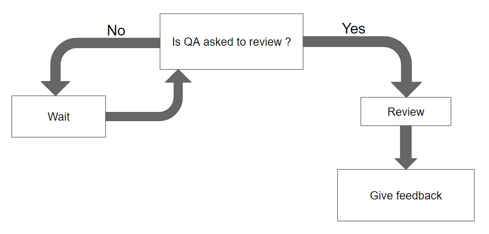

# Test-Plan
|Authors|Axel David|
|---|---|
|Created|23/09/2024|
|Last Modified|10/10/2024|
## Test-Plan-Approval
| Role | Name | Signature | Date |
|---|---|---|---|
| Project Manager | Enzo GUILLOUCHE	|----------|--/10/2024|
| Program Manager | Evan UHRING	|----------|--/10/2024|
| Technical Lead | Maxime Caron |----------|--/10/2024|
| Software Developer | Elon Delille |----------|--/10/2024|
| Technical Writer | Pierre GORIN	|----------|--/10/2024|
| Quality Assurance | Axel David |----------|--/10/2024|
## Table-of-Contents
- [Test Plan](#test-plan)
  - [Test Plan Approval](#test-plan-approval)
  - [Table of Contents](#table-of-contents)
  - [1. Introduction](#1-introduction)
    - [a. Overview](#a-overview)
    - [b. Targetted Audience](#b-targetted-audience)
      - [Retro Gaming Player](#retro-gaming-player)
      - [New Player](#new-player)
      - [Speed Runner](#speed-runner)
    - [c. Softwares/Hardwares](#c-softwares-hardwares)
      - [FPGAs](#fpgas)
      - [VERILOG](#verilog)
  - [2. Test criteria](#2-test-criteria)
    - [a. Suspension Criteria](#a-suspension-criteria)
      - [Critical Bugs](#critical-bugs)
    - [b. Entry Criteria](#b-entry-criteria)
    - [c. Exit Criteria](#c-exit-criteria)
  - [3. Test Strategy](#3-test-strategy)
    - [a. Testing Scope](#a-testing-scope)
    - [b. Testing Type](#b-testing-type)
      - [Unit Tests](#unit-tests)
      - [Functional Tests](#functional-tests)
      - [Collaborative Game-Testing](#collaborative-game-testing)
    - [c. Define Priorities](#c-define-priorities)
    - [d. Test Tool](#d-test-tool)
      - [EDA Playground / System VERILOG](#eda-playground-system-verilog)
    - [e. Test Cases](#e-test-cases)
    - [f. Bug Reports](#f-bug-reports)
      - [By QA's](#by-qa's)
      - [By Users](#by-users)
  - [4. Schedule Estimation](#4-schedule-estimation)
  - [5. Test Deliverables](#5-test-deliverables)
  - [6. Conclusion and Acknowledgements](#6-conclusion-and-acknowledgements)
  - [7. Glossary](#7-glossary)

## 1-Introduction
[comment]: <> ( 2    3    6    )
### a-Overview
We were tasked to recreate the game Frogger using an FPGA<a href="#1">[1]</a> using the verilog<a href="#2">[2]</a> language.

### b-Targetted-Audience
According to the types of players, our Frogger will have differents requierements. 
<i>Take a look at personas definition in [functional specification](https://github.com/algosup/2024-2025-project-1-fpga-team-6/blob/main/Documents/FunctionalSpecifications/functionalSpecifications.md#4-personas-definition) for more informations</i>

#### Retro-Gaming-Player
What retro players need is a game that works just fine and that allows them to feels the sentation of old games.

#### New-Player
What new players need is a working game that let them experience the game without the risk of any issues coming from the game.

#### Speed-Runner
What speed runners need is a game with no bugs and fast enough to allow them to play fast without the game crashing.

### c-Softwares-Hardwares
For this frogger project, we have been imposed to use specifics hardware and software.

#### FPGAs
FPGA is an integrated circuit that can be repeatedly programmed.
 <i>Take a look at FPGA<a href="#1">[1]</a> in the glossary for more details.</i>

#### VERILOG
Verilog is the programming language we will use to program on FPGAs.
 <i>Take a look at verilog<a href="#2">[2]</a> in the glossary for more details.</i>

## 2-Test-Criteria

#### Critical-Bugs
Critical bugs are bugs that prevent the game from working properly and from implementing new features before resolving those bugs. If a critical bug is encounter, we will suspend the tests until the bug is resolved.

### b-Entry-Criteria

### c-Exit-Criteria

## 3-Test-Strategy

### a-Testing-Scope

### b-Testing-Type

#### Unit-Tests

#### Functional-Tests

#### Collaborative-Game-Testing
Collaborative Game Testing consist in making random people play our game and report each bug.

### c-Define-Priorities

### d-Test-Tool

#### EDA-Playground-System-VERILOG
System VERILOG is a programing language used for VERILOG simulation. It permits us to test functions by setting inputs and looking at outputs. 
[EDA Playground](https://www.edaplayground.com/) is a web site with an integrated testing environment using VERILOG and System VERILOG.

### e-Test-Cases

### f-Bug-Reports

#### By-QA's

#### By-Users

## 4-Schedule-Estimation
| Task | Start Date (dd/mm/yyyy) | End Date (dd/mm/yyyy) |
| ---- | ---- | ---- |
| Review the documentation | 23/09/2024 | 21/10/2024 |
| Create and give templates | 23/09/2024 | 20/10/2024 |
| GitHub Actions | 23/09/2024 | 21/10/2024 |
| Unit tests | 16/10/2024 | 20/10/2024 |
| Functional tests | 16/10/2024 | 20/10/2024 |

## 5-Test-Deliverables
- **Test plan/test strategy:** define the testing strategy and how the tests will be done.
- **Test cases:** define all the test that will be done to be sure that the game works as intended.
- **Bug reports:** report all the bugs that have been found during the tests.
- **Bug data report:** to have a global view of the bugs that have been found during the tests.

## 6-Conclusion-and-Acknowledgements

## 7-Glossary
| Word | Definition | Source |
| --- | --- | --- |
| <a id="1">[1]</a>: FPGA | Short of Field Programmable Gate Array, it is a type of configurable integrated circuit that can be repeatedly programmed after manufacturing. | [wikipedia.org](https://en.wikipedia.org/wiki/Field-programmable_gate_array) |
| <a id="2">[2]</a>: VERILOG | It is a hardware description language (HDL) used to model electronic systems (like an FPGA). | [wikipedia.org](https://en.wikipedia.org/wiki/Verilog) |
| <a id="3">[3]</a>: VGA | Short of Video Graphic Array, it is a video display controller. | [wikipedia.org](https://en.wikipedia.org/wiki/Video_Graphics_Array) |
| <a id="4">[4]</a>: seven segment display | It is a form of electronic display device for displaying decimal numerals. | [wikipedia.org](https://en.wikipedia.org/wiki/Seven-segment_display) |
| <a id="5">[5]</a>: Konami | It is a japanese corporation focused on digital entertainment and sport businesses. | [konami.com](https://www.konami.com) |
| <a id="6">[6]</a>: SEGA | It is a japanese corporation focused on the video game business. | [sega.com](https://www.sega.com/homepage) |
| <a id="7">[7]</a>: sprite | In computer graphics, it is a two dimensional map used to texture models of a 2D game. | [wikipedia.org](https://en.wikipedia.org/wiki/Sprite_(computer_graphics)) |
| <a id='8'>[8]</a>: The Go Board|The Go Board is a low-cost, beginner-friendly FPGA development board.|[nandland](https://nandland.com/the-go-board/)|
