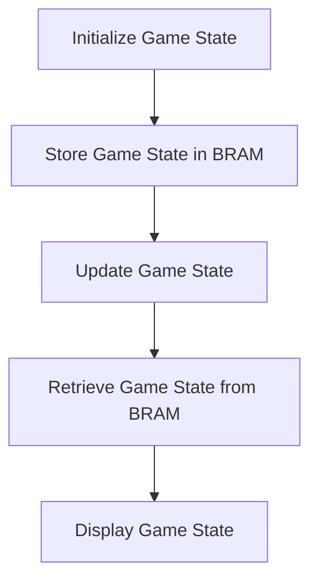
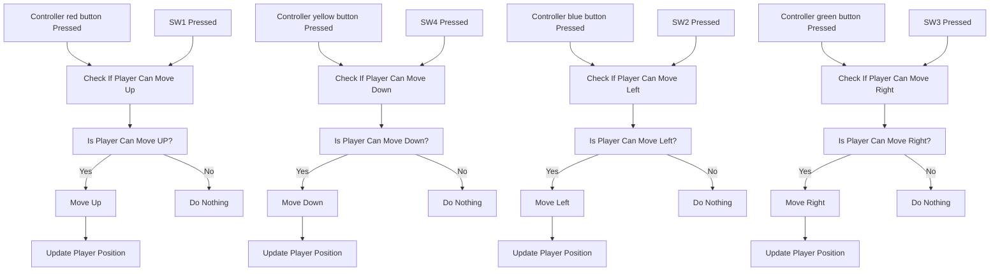
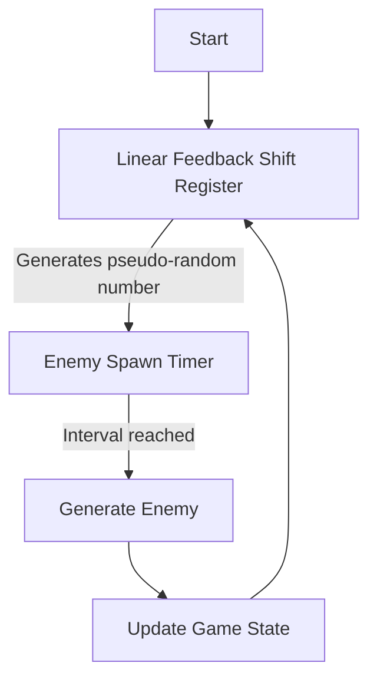
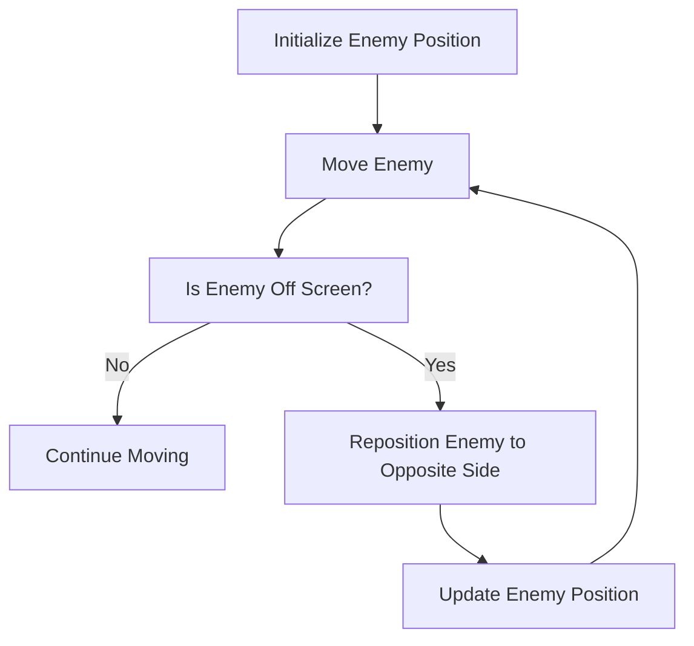
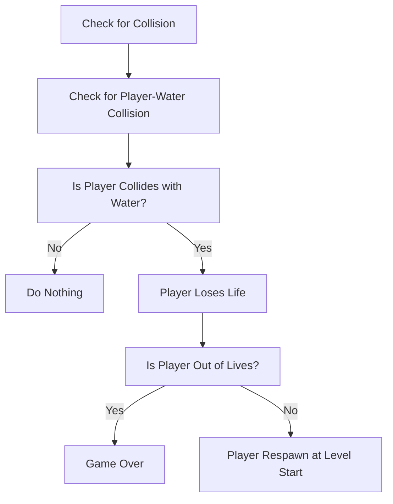
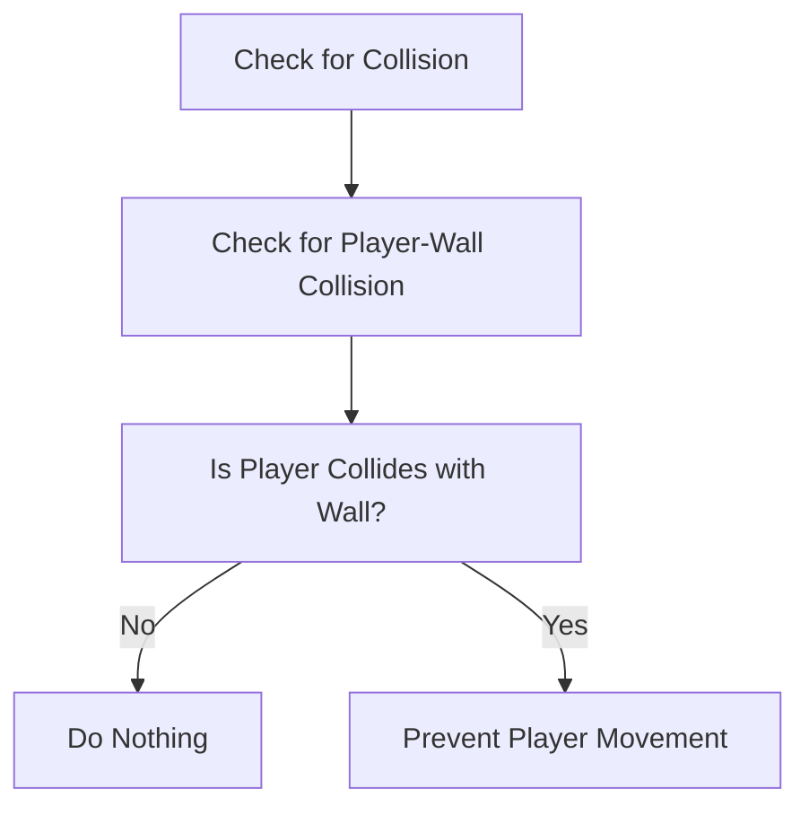
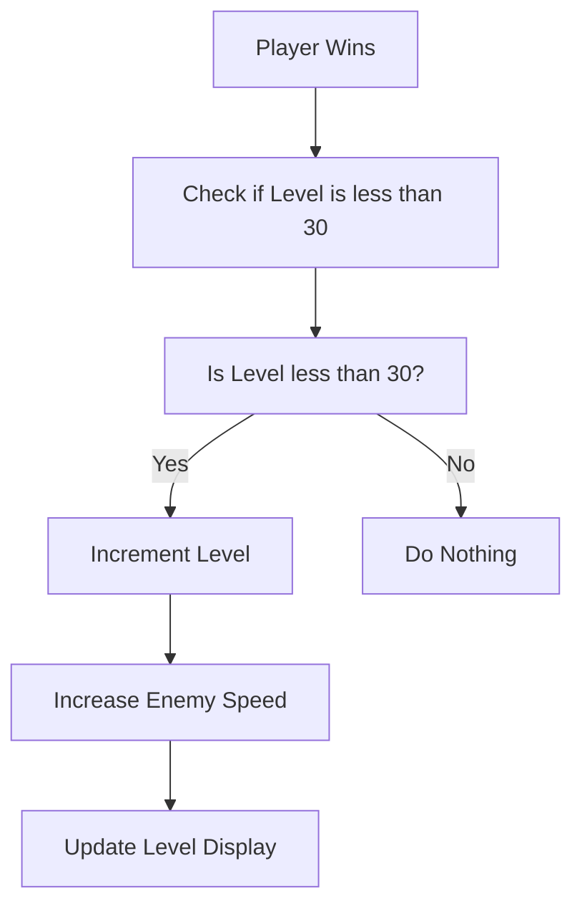

# Technical Specifications - FPGA [Team 6]

## Document Control
### Document Information
|                  | Information                                 |
| ---------------- | ------------------------------------------- |
| Document Owner   | Maxime CARON                                |
| Creation Date    | 2024/09/23                                  |
| Last Update Date | 2024/10/04                                  |
| Document Name    | Technical Specifications - Frogger [Team 6] |

### Document Version
| Version n° | Author       | Date       | Description of edits |
| ---------- | ------------ | ---------- | -------------------- |
| 0.01       | Maxime CARON | 2024/09/23 | Document skeleton    |
| 0.02       | Maxime CARON | 2024/10/01 | Reworked structure     |
| 0.03       | Maxime CARON | 2024/10/02 | Add technical specifications |

## Table of Contents

<details>
<summary><b>Click to expand</b></summary>

- [Technical Specifications - FPGA \[Team 6\]](#technical-specifications---fpga-team-6)
  - [Document Control](#document-control)
    - [Document Information](#document-information)
    - [Document Version](#document-version)
  - [Table of Contents](#table-of-contents)
  - [I. Introduction](#i-introduction)
    - [1. Glossary](#1-glossary)
    - [2. Document Purpose](#2-document-purpose)
    - [3. Project Definition](#3-project-definition)
      - [A) Vision](#a-vision)
      - [B) Assumptions](#b-assumptions)
  - [II. Technology Presentation](#ii-technology-presentation)
    - [1. NandLand GO Board](#1-nandland-go-board)
      - [A) Materials specifications](#a-materials-specifications)
        - [➭  FPGA ](#--fpga-)
        - [➭  LEDs ](#--leds-)
        - [➭  7-Segment Display ](#--7-segment-display-)
        - [➭  Push Buttons ](#--push-buttons-)
        - [➭  VGA Connector ](#--vga-connector-)
        - [➭  Micro USB Connector ](#--micro-usb-connector-)
        - [➭  PMOD Connector ](#--pmod-connector-)
      - [B) Setup](#b-setup)
    - [2. Verilog and SystemVerilog](#2-verilog-and-systemverilog)
      - [A) Language](#a-language)
        - [➭  Verilog ](#--verilog-)
        - [➭  SystemVerilog ](#--systemverilog-)
      - [B) Working Environment](#b-working-environment)
  - [III. Frogger Technical Specifications](#iii-frogger-technical-specifications)
    - [1. Project Conventions](#1-project-conventions)
    - [2. Display](#2-display)
      - [A) Graphics](#a-graphics)
      - [B) Display Resolution](#b-display-resolution)
      - [C) Grid System](#c-grid-system)
      - [D) Sprites](#d-sprites)
      - [E) Block Ram (BRAM)](#e-block-ram-bram)
    - [3. Movement](#3-movement)
      - [A) Player Movement](#a-player-movement)
        - [➭ Player Inputs for Movements](#-player-inputs-for-movements)
        - [➭ Player Movement Logic](#-player-movement-logic)
      - [B) Enemies Movement](#b-enemies-movement)
        - [➭ Enemies Pseudo Random Generation](#-enemies-pseudo-random-generation)
        - [➭ Enemies Movements](#-enemies-movements)
    - [4. Collisions](#4-collisions)
      - [A) Collisions Detection](#a-collisions-detection)
      - [B) Player Collisions Behaviors](#b-player-collisions-behaviors)
        - [➭ Water Collisions](#-water-collisions)
        - [➭ Wall Collisions](#-wall-collisions)
        - [➭ Enemy Collisions](#-enemy-collisions)
      - [C) Enemy Collisions Behaviors](#c-enemy-collisions-behaviors)
    - [5. Win Condition and Leveling System](#5-win-condition-and-leveling-system)
      - [A) Win condition](#a-win-condition)
      - [B) Leveling System](#b-leveling-system)
  - [IV. Console Technical Specifications](#iv-console-technical-specifications)
    - [1. Controllers](#1-controllers)
      - [A) Controller Inputs](#a-controller-inputs)
      - [B) Controller Electronics](#b-controller-electronics)
    - [2. 3D Models](#2-3d-models)
      - [A) Controller and Console 3D Models](#a-controller-and-console-3d-models)
      - [B) 3D Printing](#b-3d-printing)

</details>


---
## I. Introduction
---
### 1. Glossary

| Term                | Description                                                                                           | Source                                                                 |
| ------------------- | ----------------------------------------------------------------------------------------------------- | ---------------------------------------------------------------------- |
| Code Completion     | A feature in IDEs that suggests possible completions for partially typed code, improving efficiency.    | [Wikipedia](https://en.wikipedia.org/wiki/Intelligent_code_completion)  |
| FPGA                | Field Programmable Gate Array - A type of hardware used to implement digital circuits.                 | [Wikipedia](https://en.wikipedia.org/wiki/Field-programmable_gate_array) |
| Frogger             | A classic 1981 arcade game where players control a frog attempting to cross a busy road and river.     | [Wikipedia](https://en.wikipedia.org/wiki/Frogger)                      |
| IDE                 | Integrated Development Environment - Software used for writing, compiling, and debugging code.         | [Wikipedia](https://en.wikipedia.org/wiki/Integrated_development_environment) |
| NandLand            | A company that provides educational FPGA hardware and learning resources, such as the GO Board.        | [NandLand](https://www.nandland.com)                                    |
| Syntax Highlighting | A feature in IDEs that displays code in different colors and fonts to differentiate between elements.   | [Wikipedia](https://en.wikipedia.org/wiki/Syntax_highlighting)          |
| SystemVerilog       | An extension of Verilog with additional features for system-level design, verification, and simulation. | [Wikipedia](https://en.wikipedia.org/wiki/SystemVerilog)                |
| Testbenches         | Simulations that verify the functionality of a digital circuit by applying inputs and comparing outputs.| [Intel](https://www.intel.com/content/www/us/en/docs/programmable/683734)|
| Verilog             | A hardware description language (HDL) used to model and simulate digital systems at the RTL level.     | [Wikipedia](https://en.wikipedia.org/wiki/Verilog)                      |


### 2. Document Purpose

This document outlines the technical aspects of the Frogger game project, building upon the functional specifications. It defines the technical details, scope, and features of the game to ensure that the development follows the guidelines and meets project objectives.

To gain a full understanding of the project, it is recommended to first review the [Functional Specifications](/Documents/FunctionalSpecifications/functionalSpecifications.md).

This document also serves as a technical reference for development, detailing conventions, tools, and methodologies that will enhance project scalability and maintainability.

### 3. Project Definition

The goal of this project is to create a hardware implementation of the Frogger game using the NandLand GO Board and Verilog. The game will feature movement, collision detection, and scoring mechanisms.

#### A) Vision

Our vision is to recreate the classic Frogger gameplay with personalized graphics and additional features that enhance player engagement. The game will run on the NandLand GO Board, offering a fun and interactive experience.

#### B) Assumptions
Key assumptions for this project:
- The NandLand GO Board is fully operational.
- Verilog code is correctly implemented and works as expected on the FPGA.
- The functional requirements, such as movement and collisions, are properly implemented.
- The game provides smooth performance without critical bugs or errors.

---
## II. Technology Presentation
---

### 1. NandLand GO Board
The NandLand GO Board is an FPGA development board used for creating digital circuits with Verilog. It features LEDs, push buttons, a VGA connector, and other components that make it ideal for hardware projects.

> *GO Board pinout can be found [here](./Appendix/Go%20Board%20V1.pdf).*

#### A) Materials specifications

The NandLand GO Board features the following components:

##### ➭ <ins> FPGA </ins>
**FPGA (ICE40HX1K-VQ100):** The board's programmable chip, responsible for running the Verilog code. It contains 65,536 memory bits.

<div style="text-align:center">
    
</div>

> *All details about the chip can be found [here](./Appendix/ICE40HX1K-VQ100%20Family%20Datasheet.pdf)*

##### ➭ <ins> LEDs </ins>
**LEDs:** 4 programmable LEDs and 1 power indicator.

<div style="text-align:center">
    
</div>

##### ➭ <ins> 7-Segment Display </ins>
**7-Segment Displays:** Two displays for showing numeric values, such as score or timer.

<div style="text-align:center">
    
</div>

##### ➭ <ins> Push Buttons </ins>
**Push Buttons:** Four input buttons, useful for player movement and interactions.

<div style="text-align:center">
    
</div>

##### ➭ <ins> VGA Connector </ins>
**VGA Connector:** A port for connecting an external monitor to display the game.

<div style="text-align:center">
    
</div>

##### ➭ <ins> Micro USB Connector </ins>
**Micro USB Connector:** Used for power supply and FPGA programming.

<div style="text-align:center">
    
</div>

##### ➭ <ins> PMOD Connector </ins>
**PMOD Connector:** Expands the board's functionality by allowing external modules.

<div style="text-align:center">
    
</div>


Board schematics can be found in appendix [here](./Appendix/Go%20Board%20V1.pdf).

#### B) Setup
Follow the [setup tutorial](https://nandland.com/set-up-apio-fpga-build-and-program/) to configure your development environment for the NandLand GO Board.

### 2. Verilog and SystemVerilog

#### A) Language

The project will use Verilog to design and implement the game's logic, while SystemVerilog will be employed to create testbenches for verifying the Verilog modules.

##### ➭ <ins> Verilog </ins>
Verilog is a popular hardware description language for designing digital circuits. It enables the modeling and simulation of hardware components like logic gates and flip-flops.

Here's an example of a simple AND gate in Verilog:
```verilog
// This module implements an AND gate
module and_gate(input a, input b, output y);
    assign y = a & b;
endmodule
```

For more details, see the Verilog [introduction tutorial](https://www.nandland.com/verilog/tutorials/tutorial-introduction-to-verilog-for-beginners.html).

##### ➭ <ins> SystemVerilog </ins>
SystemVerilog extends Verilog, adding features like object-oriented programming and advanced testing tools. It is particularly useful for creating testbenches to verify Verilog designs.

Example of a counter using SystemVerilog:
``` verilog
// This module implements a simple counter
module counter;
    int count = 0; // Counter variable

    // Counter logic
    initial begin
        while (1) begin
            $display("Count: %d", count);
            count = count + 1;
            #1;
        end
    end
endmodule
```

#### B) Working Environment
To write and test Verilog code, users can use a text editor or an integrated development environment (IDE) such as Visual Studio Code, Xilinx Vivado, or Quartus Prime. These tools provide features such as syntax highlighting, code completion, and debugging capabilities to help users write and test Verilog code efficiently.

---
## III. Frogger Technical Specifications
---

### 1. Project Conventions
Every conventions used in the project are detailed in the [appendix 1 - project conventions](/Documents/TechnicalSpecifications/Appendix/projectConventions.md).

### 2. Display
The visual representation of the game is one of the core components, as it engages the player and enables interaction. Below are the key details regarding the display system for the Frogger game.

#### A) Graphics
The game graphics are designed to provide a visually appealing and engaging experience for the player. These graphics include elements such as the player character, enemies, obstacles, and background scenery to create an immersive game environment.

> *Details of the graphics are provided in the [Functional Specifications](/Documents/FunctionalSpecifications/functionalSpecifications.md).*

#### B) Display Resolution
The game will run on the NandLand GO Board's display, with a resolution of **640x480 pixels**. Game elements will be appropriately scaled and positioned to fit the screen size, ensuring an optimal viewing experience for the player.

The Verilog code will configure the display resolution to ensure proper rendering of game elements on the screen. The game logic will handle adjustments to the display resolution to ensure that the graphics and gameplay remain aligned with the intended visual presentation.

#### C) Grid System
A grid system will be employed to manage the positioning and movement of game elements on the screen. The grid will divide the display into cells, allowing for precise placement and movement of objects in discrete steps.

The screen will be divided into a grid consisting of 20 columns and 15 rows. Each cell will represent a specific coordinate on the screen, simplifying the handling of movement and interactions.

#### D) Sprites
The game elements such as the player character, enemies, obstacles, and background scenery will be represented using sprites. Sprites are 2D images that provide visual representations of these elements.

Each sprite will have a resolution of 32x32 pixels, ensuring detailed and recognizable graphics. These sprites will be designed to be visually distinct and easily recognizable by the player.

#### E) Block Ram (BRAM)

The game will use Block RAM (BRAM) to store the game state, player position, enemy positions, and other relevant data. BRAM provides fast and efficient memory access, making it ideal for storing and retrieving game data during runtime.

The game logic will manage the BRAM to store and update the game state, ensuring that the data is accessible and accurate at all times. The BRAM will be used to store game elements, player lives, score, and other game-related information.



### 3. Movement

#### A) Player Movement 
Each player movement is managed by the movement module. Every movement is controlled by the player input. The player can move up, down, left, and right. The player can also jump to the next cell in the direction he is moving.

##### ➭ <ins>Player Inputs for Movements</ins>
The player can move using the following inputs:
- **SW1 (Go Board switch 1):** The player moves up by one cell.
- **Controller red button (PMOD PIN 4):** The player moves up by one cell.
<br/>

- **SW4 (Go Board switch 4:** The player moves down by one cell.
- **Controller yellow button (PMOD PIN 2):** The player moves down by one cell.
<br/>

- **SW2 (Go Board switch 2:** The player moves left by one cell.
- **Controller blue button (PMOD PIN 1):** The player moves left by one cell.
<br/>

- **SW3 (Go Board switch 3:** The player moves right by one cell.
- **Controller green button (PMOD PIN 3):** The player moves right by one cell.

##### ➭ <ins>Player Movement Logic</ins>
The player movement logic will be implemented in Verilog following the activity diagram below:



#### B) Enemies Movement
Enemies will move horizontally across the screen, either left-to-right or right-to-left, depending on the lane they occupy.

##### ➭ <ins>Enemies Pseudo Random Generation</ins>
Enemies will be generated at pseudo-random intervals. The generation logic will be handled by a linear feedback shift register (LFSR), a simple pseudo-random number generator. This ensures that enemies appear at different times but follow a controlled pattern.



##### ➭ <ins>Enemies Movements</ins>

- **Movement Speed**: Each lane will have enemies with a specific, predefined speed. For instance, cars may travel faster than logs. This speed is consistent for all enemies within a given lane but can vary between different lanes to create dynamic movement patterns.
  
- **Wrap-Around Movement**: When an enemy exits one side of the screen, it will seamlessly reappear on the opposite side, simulating continuous, looping movement. This ensures the game’s flow remains uninterrupted as enemies continuously traverse the screen.



### 4. Collisions

#### A) Collisions Detection
To detect collisions between game elements, the program will check the position of each element in the grid and determine if any elements are overlapping. The collision module will handle the detection of collisions and trigger the appropriate actions based on the collision type.

The collision module will check for collisions between the player and enemies, obstacles, water, and other game elements. When a collision is detected, the collision module will trigger the corresponding behavior based on the collision type.


#### B) Player Collisions Behaviors

##### ➭ <ins>Water Collisions</ins>
When the player reaches the water, the player will lose a life. The water collisions will be managed by the collision module, which will detect when the player reaches the water and trigger the appropriate action.



##### ➭ <ins>Wall Collisions</ins>
When the player reaches the edge of the screen, the player will not be able to move further in that direction. The wall collisions will be managed by the collision module, which will detect when the player reaches the edge of the screen and prevent further movement in that direction.



##### ➭ <ins>Enemy Collisions</ins>

#### C) Enemy Collisions Behaviors

Enemy collisions will be managed by the collision module. The collision module will check for collisions between the player and enemies, obstacles, and other game elements. When a collision is detected, the appropriate action will be taken based on the collision type.


### 5. Win Condition and Leveling System

#### A) Win condition
When the player reaches the top of the screen, the player wins the game. The win condition will be triggered when the player reaches the top row of the grid. Then the level will be incremented and the player will move to the next level.

#### B) Leveling System
The game will feature multiple levels, each with increasing difficulty and challenges. The difficulty is represented by the speed of the enemies, every 5 levels the speed of the enemies will increase by 5%. The speed of the enemies will stop increasing after level 30.

The level system will be implemented in Verilog following the activity diagram below:



## IV. Console Technical Specifications

### 1. Controllers

The game will also be playable using controllers connected to the PMOD connector. These controllers will allow the player to control the movement of the player character in the game. The Verilog code will read the inputs from the controllers via the PMOD connector to update the character's position.

#### A) Controller Inputs

The controllers provide the following inputs for player movement:

- **Red Button:** Moves the player character up by one cell.
- **Yellow Button:** Moves the player character down by one cell.
- **Blue Button:** Moves the player character left by one cell.
- **Green Button:** Moves the player character right by one cell.

These inputs are mapped to the corresponding player movements. The Verilog code will handle reading these inputs and translate them into actions that adjust the player character's position on the screen.

> *More details about the movement logic can be found in the [Movement section](#3-movement).*

#### B) Controller Electronics

The controllers are connected to the PMOD connector on the NandLand GO Board, which provides a convenient interface for external modules. Each button on the controller corresponds to a specific player movement, allowing for precise control in the game.

The controller's design uses simple push buttons wired to the PMOD pins on the FPGA board. When a button is pressed, the system registers the input, and the character's movement is updated accordingly.

Below is the electronic schematic for the controller:

<div style="text-align:center">
    
</div>

### 2. 3D Models

#### A) Controller and Console 3D Models

As outlined in the [Functional Specifications](/Documents/FunctionalSpecifications/functionalSpecifications.md), both the controller and the FPGA board will be housed in custom-designed casings. These casings have been designed using [Solidworks for Makers](https://www.solidworks.com/solution/solidworks-makers) to ensure proper fit and functionality.

> *All components are available in the [3D Models folder](/3DModels).*

#### B) 3D Printing

The 3D models will be fabricated using a 3D printer. The physical components of the controller and the FPGA board casing will be created from the provided 3D models using PLA filament.

Here are the recommended parameters for 3D printing:

- **Filament:** PLA
- **Layer Height:** 0.2mm
- **Infill:** 15%
- **Print Speed:** 60mm/s
- **Temperature:** 200°C (Extruder), 60°C (Bed)

The printed components will match the design specifications of the 3D models to ensure proper assembly and functionality.
