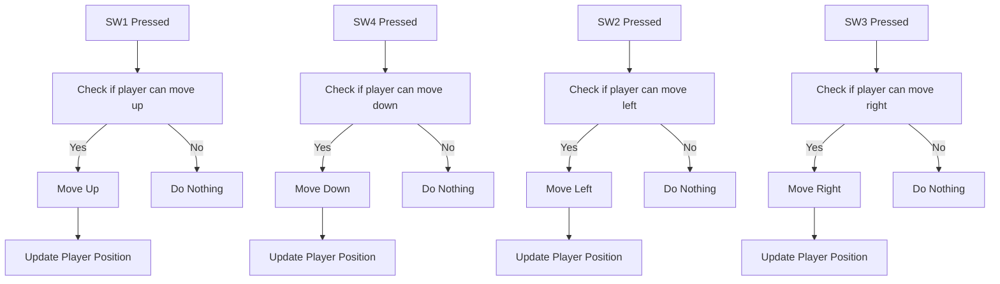
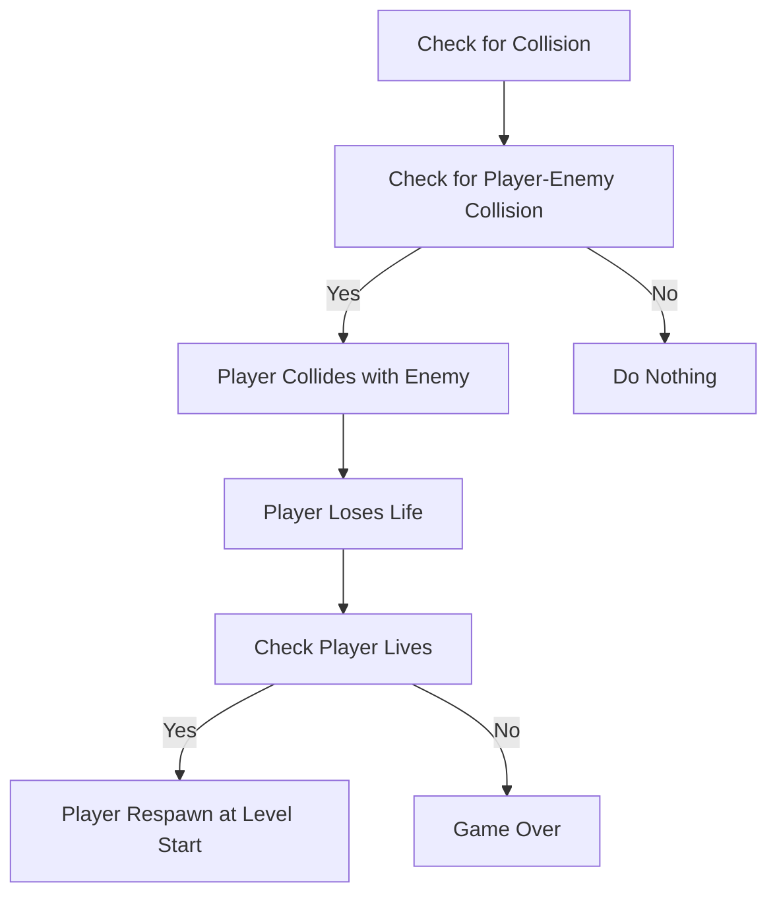
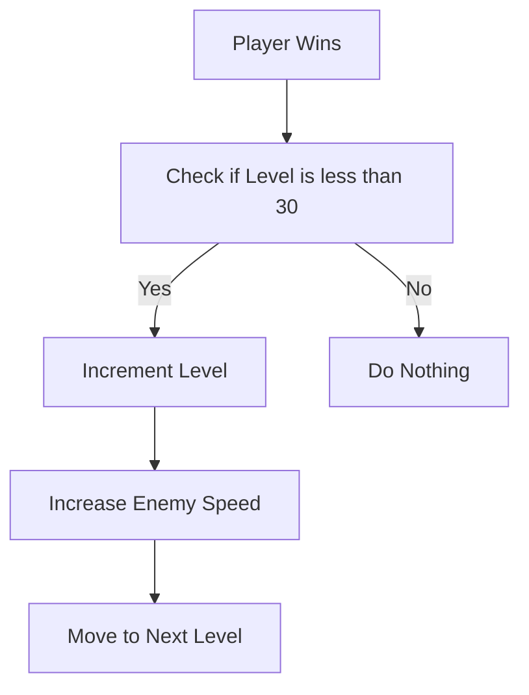

# Technical Specifications - FPGA [Team 6]

## Document Control
### Document Information
|                   | Information                                 |
| ----------------- | ------------------------------------------- |
| Document Owner    | Maxime CARON                                |
| Creation Date     | 2024/09/23                                  |
| Last Update Date  | 2024/10/02                                  |
| Document Name     | Technical Specifications - Frogger [Team 6] |

### Document Version
| Version n° | Author       | Date       | Description of edits |
| ---------- | ------------ | ---------- | -------------------- |
| 0.01       | Maxime CARON | 2024/09/23 | Document skeleton    |
| 0.02       | Maxime CARON | 2024/10/01 | Rework structure     |

## Table of Content

## I. Introduction

### 1. Glossary

| Term | Description | Source |
| ---- | ----------- | ------ |
|  FPGA    |             |        |
| Frogger  |             |        |
| NandLand |             |        |
| Verilog  |             |        |
| SystemVerilog |        |        |
| testbenches |           |        |
| IDE       |             |        |
| syntax highlighting |   |        |
| code completion |       |        |


### 2. Document Purpose

The purpose of this document is to expand upon the functional specifications by defining the features, scope, and objectives of the project. It provides detailed explanations of how each feature works and serves as a comprehensive guide for the development team and other team members who need an in-depth understanding of the application.

It is highly recommended to read the [Functional Specifications](/Documents/FunctionalSpecifications/functionalspecifications.md) before proceeding with this document.

This document serves as a reference for the development team to understand the technical requirements of the project, ensuring that the project is developed in alignment with the specified guidelines.

Additionally, it provides resources on coding conventions, database structure, graphic standards, and other aspects crucial to the maintainability and scalability of the application.

### 3. Project Definition

The project aims to develop a Frogger game using the NandLand GO Board and Verilog. The game will be implemented on the FPGA board, allowing users to play the classic Frogger game on the hardware platform. The game will include features such as movement, collisions, and scoring, providing an interactive and engaging experience for users.

#### A) Vision

The vision of the project is to keep the original gameplay experience of Frogger while personalizing graphics and adding new features to enhance user engagement. The project aims to provide a fun and challenging game that can be played on the NandLand GO Board, offering users an interactive and entertaining experience.

#### B) Goals

#### C) Future Improvements

#### D) Assumptions
For this project the team assume that:
- The NandLand GO Board is fully functional and compatible with the Verilog code.
- The Verilog code is correctly implemented and tested on the FPGA board.
- The game features are implemented according to the functional specifications.
- The game runs smoothly and provides an engaging user experience.
- The game is free of bugs and errors that may affect the gameplay.

## II. Technology Presentation

### 1. NandLand GO Board
NandLand GO Board is a hardware platform that allows users to develop and test digital circuits using Verilog. The board features an FPGA chip, LEDs, buttons, VGA connector and other components that can be used to create interactive projects. The board is designed to be user-friendly and versatile, making it ideal for educational purposes and hobbyist projects.

#### C) Materials specifications

The NandLand GO Board features the following components:

##### ➭ <ins> FPGA </ins>
**Reference:** ICE40HX1K-VQ100
**Number:** 1
**Total memory bits:** 65536

The FPGA chip is the core component of the board, responsible for executing the Verilog code and controlling the hardware components. The FPGA chip is programmable, allowing users to develop custom digital circuits and applications.

// TODO: add photo of the FPGA chip

##### ➭ <ins> LEDs </ins>
**Number:** 5

The board features 5 LEDs, 4 of which are fully programmable and can be used to display information or status indicators and 1 is used as a power indicator.

// TODO: add photo of the LEDs

##### ➭ <ins> 7-Segment Display </ins>
**Number:** 2

The board features 2 7-segment displays that can be used to display numbers and characters. The 7-segment displays can be programmed to show score, time, or other information relevant to the application.

// TODO: add photo of the 7-segment display

##### ➭ <ins> Buttons </ins>
**Number:** 4

The board features 4 buttons that can be used as input devices for interacting with the application. The buttons can be programmed to perform specific actions or trigger events in the application.

// TODO: add photo of the buttons

##### ➭ <ins> VGA Connector </ins>
**Number:** 1

The board features a VGA connector that can be used to connect an external display to the board. The VGA connector allows users to display graphics and visuals on a monitor or screen.

// TODO: add photo of the VGA connector

##### ➭ <ins> USB Connector </ins>
**Number:** 1

The board features a USB connector that can be used to connect the board to a computer for programming and data transfer. The USB connector provides power to the board and allows users to upload Verilog code to the FPGA chip.

// TODO: add photo of the USB connector

##### ➭ <ins> PMOD Connector </ins>
**Number:** 1

The board features a PMOD connector that can be used to connect external modules and peripherals to the board. The PMOD connector allows users to expand the functionality of the board by adding additional components.

// TODO: add photo of the PMOD connector

Board specifications can be found in appendix [here].
Board schematics can be found in appendix [here].

#### B) Setup
To use the board a configuration of the computer is required. The tutorial can be found [here](https://nandland.com/set-up-apio-fpga-build-and-program/).

### 2. Verilog and SystemVerilog

#### A) Language

For this project, the team will use Verilog to develop the game logic and implement the features of the Frogger game. We will also use SystemVerilog to create testbenches and verify the functionality of the Verilog code.

##### ➭ <ins> Verilog </ins>
Verilog is a hardware description language used to model electronic systems. It is commonly used in digital circuit design and FPGA programming to describe the behavior of hardware components and circuits. Verilog is a powerful and versatile language that allows users to create complex digital circuits and applications.

Here is an example of a simple Verilog code that implements a basic logic gate:

```verilog
// This module implements an AND gate
module and_gate(input a, input b, output y);
    assign y = a & b;
endmodule
```

More details about Verilog can be found [here](https://www.nandland.com/verilog/tutorials/tutorial-introduction-to-verilog-for-beginners.html).

##### ➭ <ins> SystemVerilog </ins>
SystemVerilog is an extension of Verilog that adds new features and capabilities to the language. It includes enhancements such as object-oriented programming, constrained random testing, and assertions, making it a powerful tool for developing complex digital systems.

Here is an example of a simple SystemVerilog code that implements a basic counter:

``` verilog
// This module implements a simple counter
module counter;
    int count = 0; // Counter variable

    // Counter logic
    initial begin
        while (1) begin
            $display("Count: %d", count);
            count = count + 1;
            #1;
        end
    end
endmodule
```

#### B) Working Environment
To write and test Verilog code, users can use a text editor or an integrated development environment (IDE) such as Visual Studio Code, Xilinx Vivado, or Quartus Prime. These tools provide features such as syntax highlighting, code completion, and debugging capabilities to help users write and test Verilog code efficiently.

## III. Technical Specifications

### 1. Naming Conventions and file structure

#### A) Files and Directories naming conventions
The project will follow the following naming conventions for files and directories:

##### ➭ <ins> Files </ins>

- **Verilog files:** Verilog files will be named using lowercase letters and underscores to separate words. For example, `game_logic.v`, `player_module.v`.
- **Testbench files:** Testbench files will be named using the same convention as Verilog files, with the addition of `_tb` at the end. For example, `game_logic_tb.v`, `player_module_tb.v`.
- **Documentation files:** Documentation files will be named using lowercase letters and underscores to separate words. For example, `technical_specifications.md`, `functional_specifications.md`.

##### ➭ <ins> Directories </ins>

Every directory of the project will be named using lowercase letters and uppercase for the first letter of each word. For example, `Source`, `Testbench`, `Documentation`.

#### B) Variables naming conventions
The project will follow the following naming conventions for variables:

- **Module names:** Module names will be named using lowercase letters and underscores to separate words. For example, `game_logic`, `player_module`.
- **Constants:** Constants will be named using uppercase letters and underscores to separate words. For example, `SCREEN_WIDTH`, `PLAYER_LIVES`.
- **Variables:** Variables will be named using lowercase letters and underscores to separate words. For example, `player_position`, `enemy_speed`.
- **Wires names:** Wires names will start by a `w_` and named using lowercase letters and underscores to separate words. For example, `w_player_position`, `w_enemy_speed`.
- **Input ports:** Input ports will start by `i_` and named using lowercase letters and underscores to separate words. For example, `i_player_position`, `i_enemy_speed`.
- **Output ports:** Output ports will start by `o_` and named using lowercase letters and underscores to separate words. For example, `o_player_position`, `o_enemy_speed`.

#### C) File structure
The project will follow the following file structure:

```
Frogger
│
├── Source
│   ├── gamelogic.v
│   ├── playermodule.v
│   ├── enemymodule.v
│   ├── ...
│
├── Testbench
│   ├── gamelogictb.sv
│   ├── playermoduletb.sv
│   ├── enemymoduletb.sv
│   ├── ...
│
├── Documents
│   ├── TechnicalSpecifications
│   │   ├── technicalspecifications.md
│   │   ├── ...
│   ├── FunctionalSpecifications
│   │   ├── functionalspecifications.md
│   │   ├── ...
│   ├── ...
```

#### D) Coding Standards
The project will follow the following coding standards:

- **Indentation:** The code will be indented using 4 spaces for each level of indentation.
- **Comments:** Comments will be used to explain the purpose of the code, variables, and functions. Comments will be written in English and follow a consistent style.
- **Naming conventions:** Variables, modules, and constants will be named using descriptive names that reflect their purpose and functionality. Naming conventions will follow the guidelines outlined in the previous section.
- **Code structure:** The code will be structured logically, with modules, functions, and variables organized in a clear and coherent manner. Code will be divided into separate modules for different functionalities to improve readability and maintainability.
- **Error handling:** Error handling will be implemented to detect and handle errors that may occur during the execution of the code. Error messages will be displayed to the user to provide feedback on the issue.

#### E) Comments
Comments will be used throughout the code to explain the purpose of the code, variables, and functions. Comments will be written in English and follow a consistent style to ensure readability and maintainability of the code.

Here is an example of a comment in Verilog code:
```verilog
// This module implements the game logic for Frogger
module game_logic(
    input clk, // Clock signal
    input reset, // Reset signal
    input [7:0] player_position, // Player position
    output [7:0] enemy_position // Enemy position

    // Add more comments as needed
);
```


### 2. Display

#### A) Graphics
The game graphics are designed to provide a visually appealing and engaging experience for the player. These graphics include elements such as the player character, enemies, obstacles, and background scenery to create an immersive game environment.

The graphics will be implemented using Verilog code to drive the display of the game elements. Special attention will be given to optimizing the graphics for the NandLand GO Board's display capabilities, ensuring smooth performance and high-quality visuals.

> *Details of the graphics are provided in the [Functional Specifications](/Documents/FunctionalSpecifications/functionalspecifications.md).*

#### B) Display Resolution
The game will run on the NandLand GO Board's display, with a resolution of 640x480 pixels. Game elements will be appropriately scaled and positioned to fit the screen size, ensuring an optimal viewing experience for the player.

The Verilog code will configure the display resolution to ensure proper rendering of game elements on the screen. The game logic will handle adjustments to the display resolution to ensure that the graphics and gameplay remain aligned with the intended visual presentation.

#### C) Grid System
A grid system will be employed to manage the positioning and movement of game elements on the screen. The grid will divide the display into cells, allowing for precise placement and movement of objects in discrete steps.

The screen will be divided into a grid consisting of 20 columns and 15 rows. Each cell will represent a specific coordinate on the screen, simplifying the handling of movement and interactions. This grid system will be implemented in Verilog to control the placement and movement of game elements.

#### D) Sprites
The game elements such as the player character, enemies, obstacles, and background scenery will be represented using sprites. Sprites are 2D images that provide visual representations of these elements.

Each sprite will have a resolution of 32x32 pixels, ensuring detailed and recognizable graphics. These sprites will be designed to be visually distinct and easily recognizable by the player.

In Verilog, the sprites will be implemented as arrays of pixel values, with each pixel representing a specific color value. The sprites will be displayed on the screen using the VGA connector of the NandLand GO Board.

#### E) Block Ram (BRAM)

### 3. Movement

#### A) Player Movement 
Each player movement is managed by the movement module. Every movement is controlled by the player input. The player can move up, down, left, and right. The player can also jump to the next cell in the direction he is moving.

##### ➭ <ins>Player Inputs for Movements</ins>
The player can move using the following inputs:
- **SW1 (Go Board switch 1):** The player moves up by one cell.
- **SW4 (Go Board switch 4:** The player moves down by one cell.
- **SW2 (Go Board switch 2:** The player moves left by one cell.
- **SW3 (Go Board switch 3:** The player moves right by one cell.

##### ➭ <ins>Player Movement Logic</ins>
The player movement logic will be implemented in Verilog following the activity diagram below:



#### B) Enemy Movement

##### ➭ <ins>Enemy Pseudo Random Generation</ins>

##### ➭ <ins>Enemy Movement</ins>

### 4. Collisions

#### A) Player Collisions

##### ➭ <ins>Water Collisions</ins>

##### ➭ <ins>Wall Collisions</ins>

##### ➭ <ins>Enemy Collisions</ins>

#### B) Enemy Collisions

Enemy collisions will be managed by the collision module. The collision module will check for collisions between the player and enemies, obstacles, and other game elements. When a collision is detected, the appropriate action will be taken based on the collision type.



### 5. Win Condition and Leveling System

#### A) Win condition
When the player reaches the top of the screen, the player wins the game. The win condition will be triggered when the player reaches the top row of the grid. Then the level will be incremented and the player will move to the next level.

#### B) Leveling System
The game will feature multiple levels, each with increasing difficulty and challenges. The difficulty is represented by the speed of the enemies, every 5 levels the speed of the enemies will increase by 5%. The speed of the enemies will stop increasing after level 30.

The level system will be implemented in Verilog following the activity diagram below:

